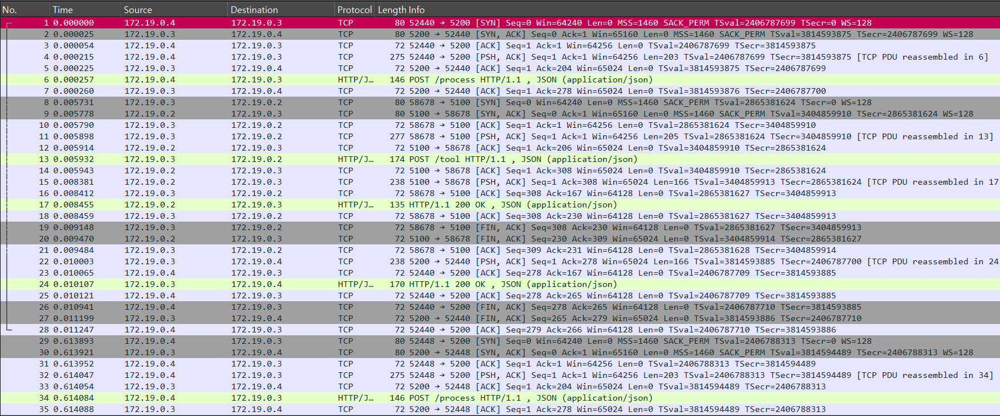
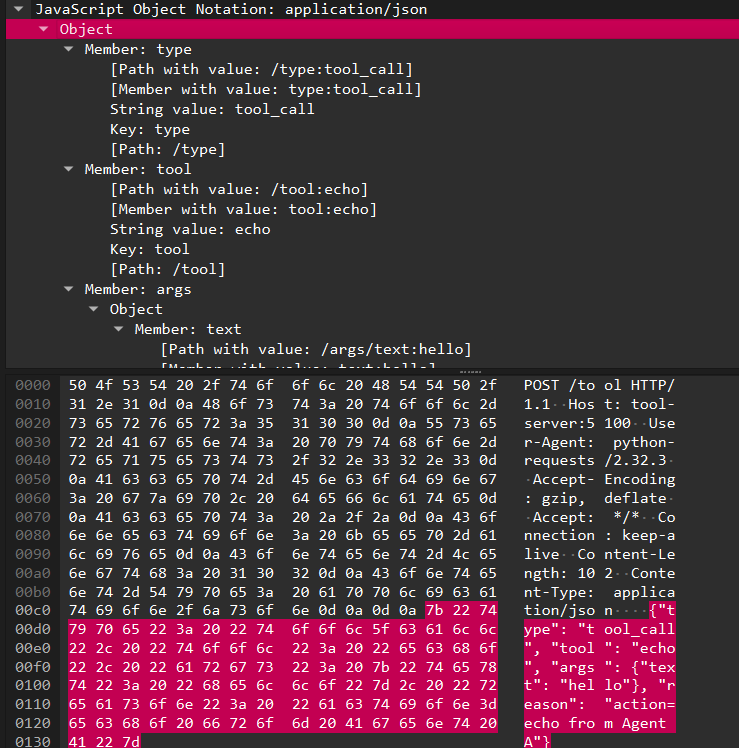
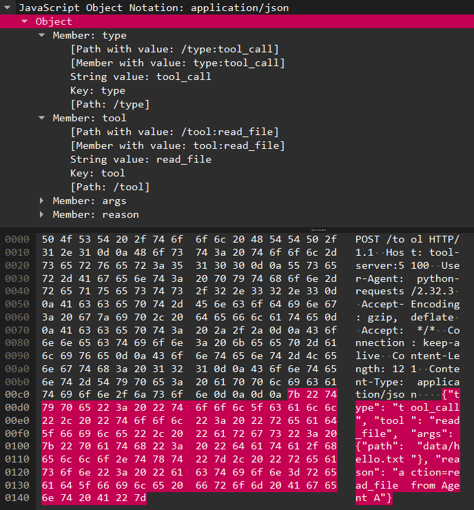

# Multi-Agent HTTP 평문 통신 관찰 및 분석

## 1. 실습 목표

본 실습의 목표는 Multi-Agent 구조에서
에이전트 간 상호작용이 실제로는 HTTP 기반 네트워크 통신으로 이루어지며,
그 과정에서 prompt / tool-call / response 정보가 평문(JSON) 형태로 네트워크 상에 노출됨을 확인하는 것을 목표로 한다.

이를 통해 다음을 학습한다.

- Agent 내부 처리 흐름과 네트워크 메시지 간의 대응 관계 이해
- HTTP payload 내 JSON 필드 의미 분석
- prompt 변경에 따른 tool-call 변화 관찰

---

## 2. 전체 시스템 구성

### 구성 요소
- Agent A
- Agent B
- Tool Server
- Sniffer (tcpdump 기반 패킷 캡처)

모든 구성 요소는 Docker 컨테이너로 실행되며,
**에이전트 및 Tool Server 간 통신은 HTTP(JSON)**로 이루어진다.

- **Agent A**
  - 컨테이너 실행 시 환경변수 `PROMPT`를 입력으로 사용
  - `PROMPT` 값에 따라 내부 로직으로 `action` 결정
    - `file` 포함 → `read_file`  
    - 그 외 → `echo`
  - 결정된 `prompt`와 `action`을 Agent B에 HTTP로 전달

- **Agent B**
  - Agent A로부터 받은 `prompt`와 `action`을 처리
  - 규칙 기반 처리 방식
    - `action=echo` → echo tool-call 생성
    - `action=read_file` → read_file tool-call 생성
  - 생성된 tool-call을 Tool Server로 HTTP 요청

- **Tool Server**
  - Agent B의 요청에 따라 tool 실행
  - 자체 판단 로직 없이 요청된 작업만 수행
    - `echo`
    - `read_file (data/hello.txt)`

---

## 3. 코드 구조 설명 (prompt / tool-call /response)

### 3.1 prompt 생성 및 전달(Agent A)
```python
PROMPT = os.environ.get("PROMPT", "hello")

def choose_action(prompt: str) -> str:
    # prompt에 'file'이 포함되면 read_file, 아니면 echo
    return "read_file" if "file" in prompt.lower() else "echo"
```
- Agent A는 컨테이너 실행 시 환경변수 PROMPT를 입력으로 받는다.
- choose_action() 함수는 prompt 내용을 검사하여 사용할 action을 결정한다.
- 결정된 prompt와 action은 다음과 같이 Agent B로 HTTP 요청으로 전달된다.

```python
prompt_msg = {
    "type": "prompt",
    "from": "agent-a",
    "prompt": PROMPT,
    "action": action
}

requests.post(f"{AGENT_B_URL}/process", json=prompt_msg)
```

- 이 요청은 Agent A → Agent B 로 전송되는 HTTP POST /process 요청이다.
- Agent A의 내부 판단 결과(action)가 JSON payload에 포함된다.

---

### 3.2 tool-call 생성(Agent B)
```python
data = request.get_json()
action = data["action"]
prompt = data["prompt"]
```

- Agent B는 Agent A로부터 전달받은 JSON에서 action 값을 추출한다.
- 이 값을 기반으로 Tool Server에 전달할 tool-call 요청을 생성한다.

```python
tool_payload = {
    "type": "tool_call",
    "tool": action,
    "args": {
        "text": prompt
    },
    "reason": f"action-{action} from Agent A"
}

requests.post(TOOL_URL, json=tool_payload)
```

- tool 필드에는 호출할 tool 이름이 들어간다.
- Agent B의 판단 없이, Agent A의 action 값을 그대로 사용한다.

---

### 4.3 response 반환(Tool Server)
Tool Server는 전달받은 tool-call 요청에 따라 tool을 실행하고,
결과를 JSON 형태로 반환한다.

```json
{
  "type": "response",
  "result": "hello"
}
```

- 이 response는 HTTP 200 OK 응답으로 Agent B를 거쳐 Agent A에 전달된다.

---

## 5. 실행 결과

### 5.1 HTTP 패킷 전체 캡처

아래 캡처는 에이전트 간 통신이 실제로 HTTP 네트워크 트래픽으로 발생함을 보여준다.



- Agent A → Agent B : POST /process
- Agent B → Tool Server : POST /tool
- Tool Server → Agent B → Agent A : HTTP/1.1 200 OK

---

### 5.2 HTTP payload 내 JSON 필드 분석

아래는 Tool Server로 전달된 tool-call 요청의 HTTP payload(JSON)이다.




이 JSON payload를 통해 다음을 확인할 수 있다.
- Agent 내부 판단 결과(tool = echo)
- tool 실행에 필요한 인자
- tool 선택 근거(reason)

즉, 에이전트 내부 처리 흐름이 평문 JSON 형태로 네트워크 상에 노출됨을 알 수 있다.

---

### 5.3 prompt 값 변경 후 tool-call의 변화

Agent A의 PROMPT 값만 변경했을 때,
tool-call JSON의 tool 필드가 변화하는 것을 확인하였다.

| PROMPT 값          | tool-call 결과     |
| ------------------ | ----------------- |
| `hello`            | `tool: echo`      |
| `please read file` | `tool: read_file` |




이를 통해 prompt → action → tool-call → HTTP JSON 변화의 관계를 명확히 확인할 수 있다.

---

## 6. 1주차 학습과의 차이 (단일 에이전트 vs 멀티 에이전트)

| 구분      | Week 1 (단일 에이전트) | Week 2 (멀티 에이전트)                 |
| ------- | ---------------- | -------------------------------- |
| 에이전트 수  | 1개               | 2개 이상                            |
| 처리 방식   | 내부 로직 중심         | 에이전트 간 HTTP 통신                   |
| 네트워크 노출 | 거의 없음            | prompt / tool-call / response 노출 |
| 관찰 방법   | 로그 중심            | Wireshark 패킷 분석                  |


---
