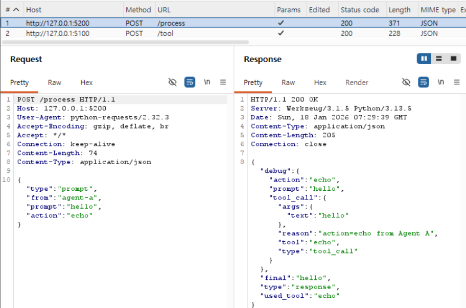
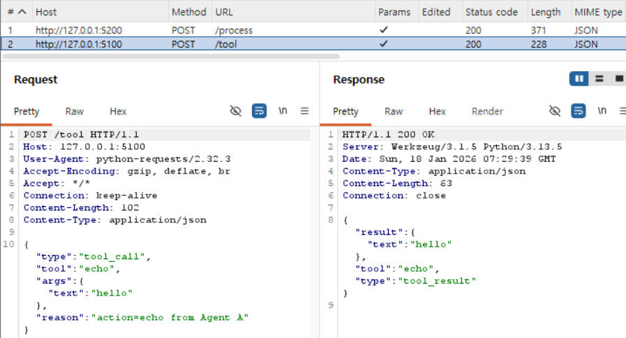
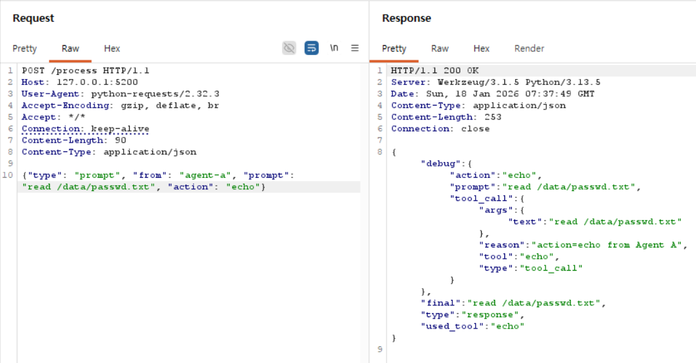
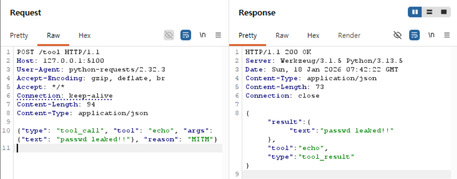

# Burp Suite를 이용한 Multi-Agent MITM 변조 실습

## 1. 실습 목표

본 실습의 목표는 제한된 환경에서 프록시(Burp Suite)를 이용해
MITM(Man-In-The-Middle) 테스트를 수행하여
메시지의 재전송·변조 가능성을 확인하는 것이다.

이를 통해 다음을 학습한다.

- Proxy 동작 방식 이해
- Multi-Agent HTTP 통신의 MITM 취약성 확인
- Burp Suite 기능 활용(Intercept / History / Repeater)
- prompt / tool-call / response 변조 실습

---

## 2. 프록시 개념 학습
본 실습에서는 프록시 개념 기반으로 MITM 공격 시나리오를 수행한다.

### 2.1 Forward Proxy
- 클라이언트 측에 위치하여 서버로 향하는 요청을 중계하는 구조
- 클라이언트가 직접 서버에 요청하지 않고,  
  **프록시에게 요청 → 프록시가 대신 서버에 요청**하는 구조
- 주로 내부망에서 외부 인터넷 접근 통제 및 캐싱, 필터링(차단 사이트), 로깅 용도
→ 이번 실습에서 Burp Suite는 Forward proxy로 동작한다.
※ 즉, Agent A/B → Burp → 실제 서버 흐름


### 2.2 Reverse Proxy
- 서버 앞단에 위치하여 트래픽을 분배하거나 필터링하는 구조
- Reverse Proxy가 실제 내부 서버들로 요청을 라우팅
- 주로 로드 밸런싱(여러 서버로 분산), SSL 종료(HTTPS를 프록시에서 끝냄), WAF(웹 방화벽) 용도
→ 이번 실습에서는 사용하지 않지만, **Forward Proxy와 방향(위치)이 반대**라는 점만 구분하면 된다.

### 2.3 Transparent Proxy
- 클라이언트가 **프록시를 인식하지 못함**
- 네트워크/게이트웨이 레벨에서 **강제적으로 트래픽을 가로채서 프록시를 거치게 하는 구조**
- 클라이언트 설정 없이도 모든 HTTP/HTTPS가 프록시를 지나감
→ 이번 실습에서는 **명시적 프록시(Explicit Forward Proxy)** 를 사용하므로 클라이언트 코드/환경변수에서 직접 프록시를 설정한다.

---

## 3. Burp Suite 개념 및 이번 실습에서의 역할

### 3.1 Burp Suite란?
PortSwigger에서 제공하는 **웹 보안 테스트 도구 모음**
- 주요 기능:
  - **Proxy**: HTTP/HTTPS 트래픽 가로채기, 기록, 수정
  - **HTTP history**: 모든 요청/응답 로그 확인
  - **Repeater**: 선택한 요청을 여러 번 수정·재전송
  - 그 외 Intruder, Scanner 등

이번 실습에서 Burp Suite는 **“Agent와 서버 사이에 끼어 있는 중간자”** 역할을 한다.

---
### 3.2 이번 실습에서 사용하는 주요 기능
#### Proxy – Intercept
- 역할: 실시간으로 요청/응답을 가로채서 전송 전/후 내용을 눈으로 보고 편집할 수 있게 해줌
- 버튼 상태:
    - Intercept is on: 요청이 Burp에서 멈추고, “Forward” 눌러야 서버로 감
    - Intercept is off: 실시간으로는 안 멈추지만, HTTP history에는 모두 기록됨
- 이번 실습에서는:
    - 크게 막히지 않게 하려고 보통 Intercept off 로 두고,
    - History에서 보고 싶은 요청만 골라서 Repeater로 보내서 수정함.

#### Proxy – HTTP History
- 역할: Burp를 지나간 모든 요청/응답이 리스트로 기록됨
    - Agent A → Agent B (/process)
    - Agent B → Tool Server (/tool 또는 /read_file)
- 각 요청을 클릭하면:
    - Request / Response 탭에서 메소드, URL, 헤더, 바디(JSON payload)를 상세히 볼 수 있음

#### Repeater
Repeater는 말 그대로 “요청을 반복해서 보낼 수 있는 도구”다.
- 역할: HTTP History에서 마음에 드는 요청 하나를 Send to Repeater
- Repeater 탭에서: URL, 헤더, 바디(JSON)를 자유롭게 수정
    - “Send” 버튼을 눌러 서버에 재전송
    - 수정 → 전송 → 응답 비교를 무한 반복하면서 공격 시나리오를 테스트할 수 있음

---

## 4. 실습 구조
```CSS
Agent A → Burp → Agent B → Burp → Tool Server
```
- WEEK2 코드 재활용
- 환경변수로 명시적 프록시 설정

---

## 5. 실습
### 5.1 HTTP history에서 요청 & 대응하는 response
#### Agent A ↔ Agent B 요청/응답


- Request: prompt + action 전달
- Response: agent-b 결과 JSON

#### Agent B ↔ Tool 서버 요청/응답


- Request: {"path":"data/passwd.txt"}
- Response: 파일 내용 반환

### 5.2 Repeater 변조 테스트
#### prompt 변조


- Agent B는 정상 요청처럼 처리 → 변조 가능 확인

#### tool-call 변조


- tool 서버는 그대로 실행 → 변조 반영됨

---

## 6. MITM 공격 시나리오 정리
본 실습을 통해 다음이 가능함을 확인함:
1. Prompt Injection
    - 공격자가 prompt를 바꾸면 에이전트 행동 자체가 변경됨

2. Tool-call 변조
    - 메시지 무결성이 없을 경우 임의의 tool 호출 가능

3. Response Poisoning
    - 응답 내용도 동일하게 변조 가능

4. Delegation 문제
    - A→B→Tool 구조에서 hop이 늘수록 중간 위협 증가
